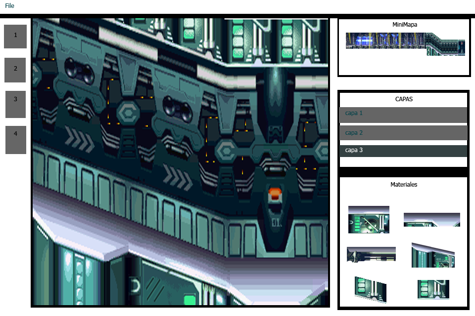

# ProjectX_Herramienta
Project X - Herramienta

Es una herramienta que se usara para diseñar niveles para Project X , se podra editar (modificar,eliminar...) libremente el diseño del nivel que estara dividido en capas para poder usar fondos ,probs ,etc. La herramienta esta destinada a ser usada para el projecto de "Project X".

Categoria: 2D platform , Shoot'm Up.

INTEGRANTES:
- Alfredo Apaza
- Jean Carretero

# ScreenShots

# Propiedades del Formato
El tamaño del mapa sera de 1200 x 600
El tamaño de las ranuras de Tile sera de 50x50
## Capas

### Capa de Fondo (Funciona)
La capa de fondo almacenara imagenes que se ubicaran en el fondo del nivel.

### Capa de Probs (Funciona)
La capa de probs poseera un PosX , PosY y Profundidad para que estos puedan estar al frente o al fondo.

### Capa de Tiles (Funciona)
Los tiles tendran PosX, PosY , estos tendran tamaños exactos y medidos como 50x50 ,  100x50 ,etc .

### Capa de Items (Aun no inplementado)
Almacenara la posicion inicial de los items 

## Tileset
Estaran en la carpeta "Img" del proyecto , tendran tamaños fijos.

## Archivos
Iconos de Mini-Herramientas como Eliminar,Mover,etc.Estos estaran en una carpeta llamada "Icon".

## Otros
Posicion Inicial del Player
